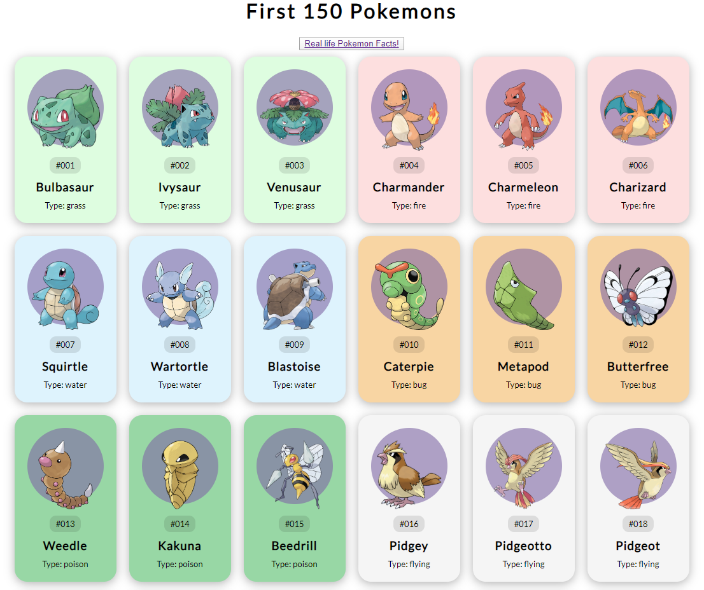
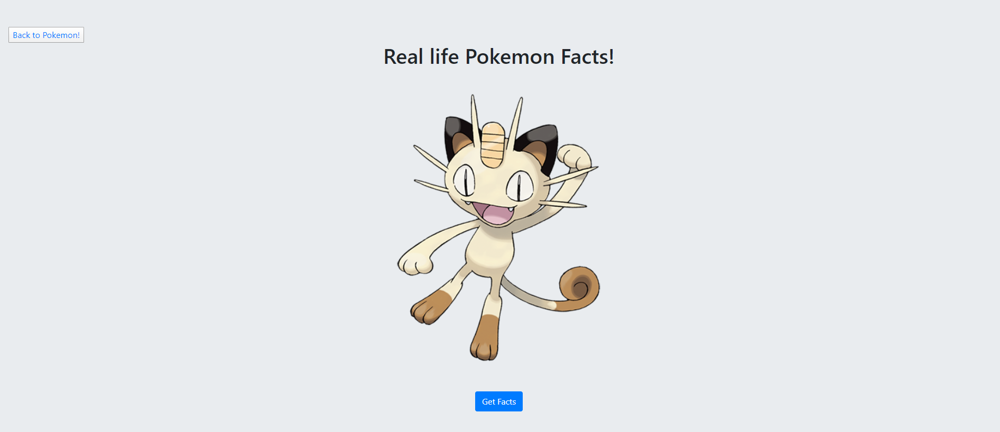
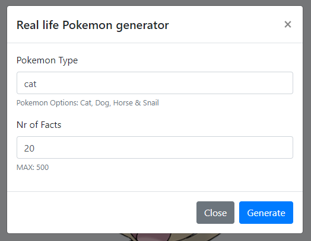
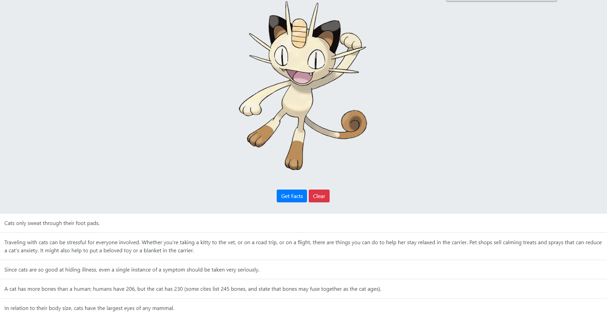

# Pokemon APP

Aceasta aplicatie foloseste doua api uri **[https://pokeapi.co/](https://pokeapi.co/)** si **[https://alexwohlbruck.github.io/cat-facts/docs/](https://alexwohlbruck.github.io/cat-facts/docs/)** pentru a introduce utilizatorul in lumea primilor 150 de pokemoni din prima serie. Pokemonii sunt fiinte de diferite dimensiuri si forme, majoritatea fiind inspirate din animale din lumea reale.

## Descrierea problemei

De mai bine de 15 ani, copiii din întreaga lume au descoperit lumea fermecătoare a Pokemonului. Astăzi, familia de produse Pokémon include jocuri video, jocuri de cărți Pokémon, seriale TV animate Pokémon, filme, jucării și multe altele. Jocurile încurajează gândirea strategică și, în multe cazuri, abilitățile de bază ale matematicii. Pokémon pune un accent deosebit pe sportivitatea și respectul față de ceilalți jucători. Și mulți părinți consideră că Pokémon TCG și jocurile video Pokémon își încurajează copiii să învețe să citească, deoarece citirea este necesară în majoritatea jocurilor Pokémon.[1] In aplicatia dezvoltata de mine sunt prezentati primi pokemoni creati vreodata, deoarece mojoritatea acestora sunt inspirati de animale din lumea reala am simtit nevoia sa adauga o alta parte proiectului, care genereaza lucruri amuzante despre pisci, caini, cai si melci, aceste animale fiind doar cateva din cele care au inspirat fiintele din aceasta serie.

## Descriere API-uri

**PokeApi** este un API  REST care ofera date legate de pokemoni, majoritate datelor provin din franciza jocurilor. API-ul ofera o bază de date cu mii de obiecte legate de Pokémoni, iar interfețele sunt legături URL. Un API RESTf este un API care se conformează unui set de convenții libere bazate pe verbe HTTP, erori și hyperlink-uri. [2]

**Cats Facts** este un API care ofera detalii random, zilnic despre pisici prin intermediul site-ului **[https://cat-fact.herokuapp.com/#/](https://cat-fact.herokuapp.com/#/)** unde utilizatorii scriu zilnic detalii amuzante despre pisici.

## Rename a file

You can rename the current file by clicking the file name in the navigation bar or by clicking the **Rename** button in the file explorer.

## Fluxul de Date
	function  fetchFacts() {
	fetch(`https://cat-fact.herokuapp.com/facts/random?animal_type=${animal_value}&amount=1`)
	.then(response  =>  response.text())
	.then(data  => {
	let  fact  =  JSON.parse(data).text
	console.log(fact)
	var  para  =  document.createElement("p");
	para.classList.add('list-group-item')
	para.classList.add('text-dark')
	para.classList.add('p-3')
	var  node  =  document.createTextNode(fact);
	para.appendChild(node);
	let  facts  =  document.querySelector(".facts");
	facts.appendChild(para);
	})
	.catch(err  =>  console.log(err))
	}
Acest snippet de cod reprezinta cum aplicatia preia datele din API-ul CatFacts.

	const  getPokemon  =  async  id  => {
	const  url  =  `https://pokeapi.co/api/v2/pokemon/${id}`;
	const  res  =  await  fetch(url);
	const  pokemon  =  await  res.json();
	createPokemonCard(pokemon);
	};
    
Acest snippet de cod prezinta cum sunt preluati pokemonii din API-ul PokeAPI.

## Capturi ecran

##Referinte
[1]pokemon.com/us/parents-guide/
[2]https://pokeapi.co/
